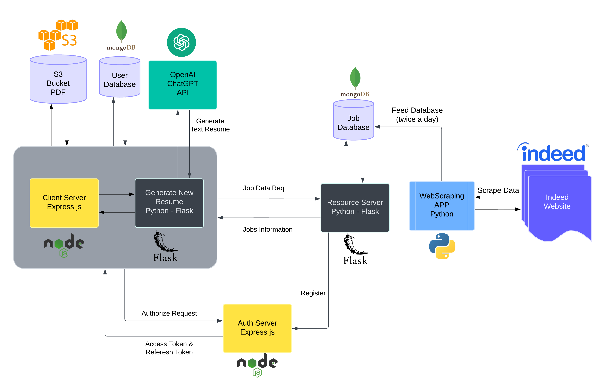

# ResuMatch.AI

**ResuMatch.AI** is a comprehensive job application platform that leverages AI, web scraping, and microservices architecture to simplify and enhance the hiring process. The platform not only aggregates job postings from the Indeed website but also provides job seekers with personalized resumes tailored to specific job descriptions, ensuring better alignment between candidates and opportunities.

---

## Technical Highlights

- **Programming Languages & Frameworks:** Python (Flask), JavaScript (Express.js, EJS), OpenAI API.
- **Databases & Storage:** MongoDB for user data, S3 for resume storage.
- **Security & Authentication:** Token-based authentication for secure microservices communication, leveraging Express.js.
- **GenAI Integration:** NLP-powered resume tailoring using OpenAI GPT models for accurate and meaningful adjustments.
- **Architecture:** Microservices design with API-based interaction, ensuring modularity, scalability, and easy maintenance.

---

## Key Features and Architecture

### 1. Web Scraping and Job Database Management
- A Python-based web scraping module continuously gathers job postings from the **Indeed website**, ensuring the job database is always up-to-date with the latest opportunities.
- This data is hosted on a dedicated **Flask-based job server**, which handles client requests for job information.

### 2. Resume Tailoring with AI
- Users can upload their resumes through a secure interface. These resumes are stored in **Amazon S3 buckets**, with corresponding URLs managed in a **MongoDB database**.
- Using **OpenAI's GPT models**, the system generates personalized, job-specific resumes by analyzing both the user's existing resume and the job description, optimizing compatibility.

### 3. Microservices Communication and Authentication
- A robust **Express.js authentication server** manages secure communication between microservices. This implementation ensures seamless and secure interactions between the resource server and client server using authentication tokens.

### 4. Client Server and User Management
- Built using **Express.js** with **EJS templates**, the client server provides a dynamic and user-friendly interface for job seekers and administrators.
- Features include user management, admin management, and workflow control. It also acts as the primary interface for interacting with the Flask server responsible for AI-powered resume generation.
- Communication between the client server and the Flask server is secured using API keys, as both belong to the same operational entity.

### 5. Cloud and Database Integration
- User data, including resumes and account information, is securely stored in **MongoDB** and Amazon's **S3 cloud storage**.
- The architecture ensures scalability, security, and high availability, catering to diverse user demands.
